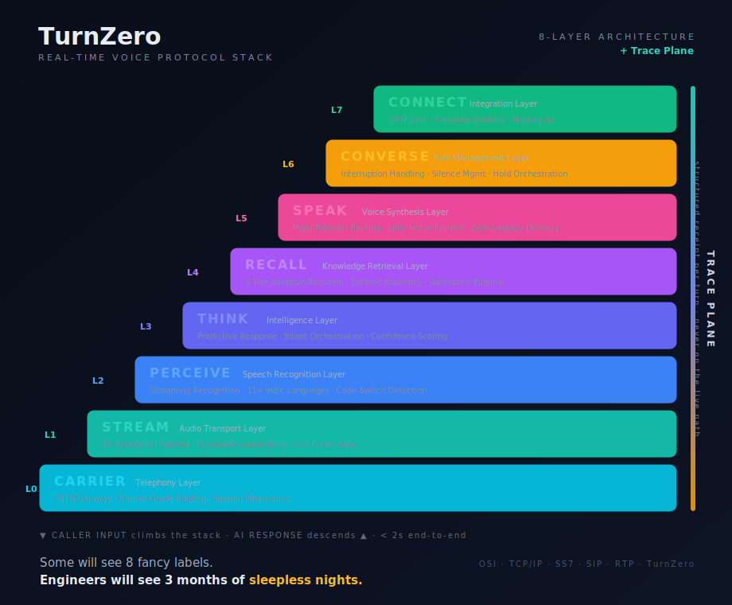

# TurnZero

**A layered protocol stack for real-time voice agents — engineered for sub-2-second conversational turns.**

> Twenty years ago, I memorised the 7 layers of the OSI model for an exam. I never thought I'd end up building one.

Making an AI answer a phone call *naturally* is not an API wrapper. It is a systems engineering problem — the kind where every layer depends on every other layer, and a 200ms delay anywhere breaks the entire experience.

So I did what any telecom engineer would do. I designed it as a protocol stack.



This repository is a **clean, minimal reference implementation** of that stack. It is not the production platform — it carries no customer data and none of the commercial internals. It is the *orchestration core*, stripped to its bones, so another engineer can read it in five minutes and understand exactly why each layer exists.

---

## The thesis: orchestration is the product

Most voice agents are a smart model behind a tool menu: audio in -> transcribe -> prompt -> model -> speak. It works in a demo. It falls apart on a live call — in a noisy room, in Hindi-English code-switching, under a latency budget that punishes every wasted millisecond.

TurnZero treats the conversational turn the way SS7 treats a call: as a signal that climbs a stack of single-responsibility layers and comes back down, with every layer observable and replaceable.

A caller's voice enters at **Layer 0**. It climbs the stack. The agent perceives, thinks, recalls, and speaks. The response travels back down. All in under two seconds.

---

## The stack

| Layer | Name | Responsibility | Key concerns |
|-------|------|----------------|--------------|
| **L7** | **CONNECT** | Integration | CRM sync, calendar booking, messaging channels |
| **L6** | **CONVERSE** | Turn management | Interruption handling, silence management, hold orchestration |
| **L5** | **SPEAK** | Voice synthesis | Multi-provider routing, Indic voice profiles, zero-latency delivery |
| **L4** | **RECALL** | Knowledge retrieval | 3-tier adaptive retrieval, context assembly, relevance pipeline |
| **L3** | **THINK** | Intelligence | Predictive response engine, intent orchestration, confidence scoring |
| **L2** | **PERCEIVE** | Speech recognition | Streaming recognition, 11+ Indic languages, code-switch detection |
| **L1** | **STREAM** | Audio transport | Bi-directional pipeline, persistent connections, sub-frame sync |
| **L0** | **CARRIER** | Telephony | PSTN gateway, carrier-grade routing, session persistence |

A caller's voice enters at **L0 (CARRIER)** and climbs to **L3 (THINK)**, where intent is resolved against knowledge pulled by **L4 (RECALL)**. The response is synthesised at **L5 (SPEAK)**, governed by **L6 (CONVERSE)**, and any side-effects (a booking, a CRM note) are handled at **L7 (CONNECT)** — all inside the turn.

---

## The Trace Plane (cross-cutting)

The stack has one more idea that isn't a layer — it runs *across* all eight.

Most stacks can tell you *what* happened on a call. They can't tell you *why* the agent said what it said. The **Trace Plane** is a diagnostics rail that every layer writes to during the turn: what PERCEIVE heard and with what confidence, what intent THINK resolved, what RECALL retrieved and how relevant it was, whether confidence was high enough to answer or low enough to *defer*.

A confident wrong answer stops being a mystery and starts having a shape. For a banking or BPO buyer, that shape is the difference between a demo and something you can actually put in front of regulated traffic.

Crucially, the trace plane must never cost latency — it leaves structured receipts *alongside* the live path, not inside it.

---

## Why this is hard (the part that doesn't show)

- **The latency budget is unforgiving.** Sub-2-second end-to-end means every layer has a millisecond allowance, spent the moment you stop paying attention. `docs/ARCHITECTURE.md` breaks the budget down layer by layer.
- **Streaming everywhere.** Nothing waits for "done." PERCEIVE streams partials; THINK streams first-sentence-first; SPEAK starts talking before the full response exists.
- **Barge-in is a first-class citizen.** Humans interrupt. CONVERSE has to detect speech mid-response and yield, like a person would.
- **Observability can't cost latency.** The trace plane leaves receipts without slowing the turn it observes.

> Some will see 8 fancy labels. Engineers will see 3 months of sleepless nights.

---

## Repository layout

```
src/
  telephony/     L0 CARRIER   — telephony / transport edge
  voice/         L1 STREAM, L2 PERCEIVE, L5 SPEAK
  llm/           L3 THINK     — intelligence
  retrieval/     L4 RECALL    — hybrid retrieval
  orchestrator/  L6 CONVERSE  — turn management + the trace plane
  ...            L7 CONNECT   — integration hooks
evals/           reliability + latency eval harness
docs/            ARCHITECTURE.md and the layer diagram
```

## Quick start

```bash
cp .env.example .env      # add your own keys
pip install -r requirements.txt
python -m src.orchestrator.demo
```

See [`docs/ARCHITECTURE.md`](docs/ARCHITECTURE.md) for the full design, the latency budget, and the trace-plane contract.

---

## A note on what this is and isn't

This is a teaching artifact and a design reference — the architecture I arrived at after building a production voice platform solo. It is deliberately minimal. The interesting parts are the *shape* of the stack and the *trace contract*, not the line count.

If you've ever debugged an SS7 trace or read an RFC at 2am, you'll look at this and know exactly why each layer is where it is — and probably why it took three months to get right.

OSI · TCP/IP · SS7 · SIP · RTP · **TurnZero**

---

*Built by Rajan Sharma · [digitalstaf.com](https://digitalstaf.com) · LinkedIn: [Rajan Sharma](https://linkedin.com/in/rajan-sharma-6bb36238)*

MIT — see [LICENSE](LICENSE).
